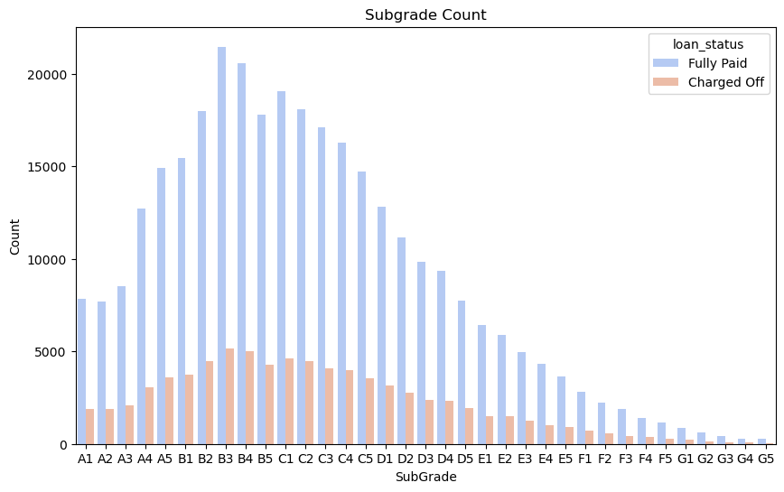
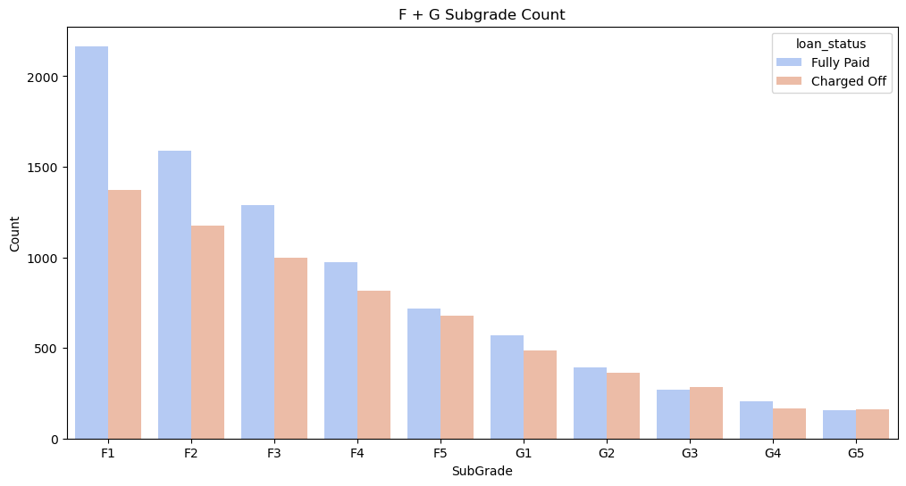
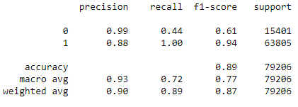

# Lending Club End-to-End Project

# Overview
This project utilizes a dataset from LendingClub, a US-based peer-to-peer lending company, to build a deep learning model that predicts whether borrowers will pay back their loans. **The primary objective of this project is to aid LendingClub in assessing the risk of loan applications, enhancing decision-making processes for loan approvals.** The model is developed using Keras, a powerful deep learning library. The methodologies involded include Data Preprocessing, feature engineering, and a neural network model.

***Data Overview**

The dataset is a subset of the LendingClub data available on Kaggle, which has been specially modified to demonstrate feature engineering techniques. It includes various attributes of loans and borrowers such as loan amount, interest rate, borrower"s employment length, credit history, and more.

 

The dataset includes: loan amount, loan term, interest rate, monthly payment, loan status, loan grade, loan subgrade, employment title, employment length, home ownership status, annual income, income verification status, loan issue date, loan purpose, loan title, borrower"s state and zipcode, debt-to-income ratio, earliest credit line, number of open credit accounts, number of derogatory public records, total revolving credit balance, revolving credit utilization, total credit lines, initial loan listing status, application type, number of mortgage accounts, and number of public record bankruptcies.

 

# <ins>EDA, Feature Engineering, and Data Preprocessing<ins> 
###  <ins>Initial EDA<ins>

I visualized several the relationships in order to get a better understanding of the features and the correlations of those features.

Since we will be attempting to predict loan status, I started with a count plot of the loan statuses and that summary statistics. There are many more loans that are Fully Paid compared to Charged off:

I then wanted to to see the distribution of the loan amounts:

I then wanted to see if there was a relationship between the **loan status and the loan amount**. It seems that there"s a slight increase in likelihood of the loan not being paid off if it"s higher, which makes sense..

I dove deeper by looking at the summary statistics of the loan status and loan amount. This confirmed the initial findings:

Next I wanted to visualize the **“grade”** (LC assigned loan grade) and the rate of the loans being paid off. As expected, the better grades (ex. A) have a much higher likelihood of being paid off compared to lower grades (ex. G). 

I then wanted to visualize the **subgrade** to see if there was a clear distinction between the subgrades of the grades.

I dug deeper into the F and G subgrades because it"s not depicted well in the graph above, and there is a lot lower frequency. 

I noticed that for both debt to income ratio and revolving utilization rate, there were many outliers (which I dealt with later). However, I wanted to see what the 'normal' distribution was for both of these:

###  <ins>Correlations<ins>

To get a sense of the correlations for all the numeric columns, I created the heatmap below. The lighter the color, the more positevly correlated the two features are. There are very strong correlations between features like Number of public record bankruptcies, number of open accounts, total number of accounts, interest rate on the loan, report annual income, and more. These all make logical sense given the context and description. 

For example, there"s an almost perfect correlation with the "installment" and "loan_amnt" feature, which makes sense given that “installment” is the monthly payment owed by the borrower if the loan originates. I visualized these two features below:

I then wanted to see the correlations of the numeric columns to whether a loan was repaid. This correlation is useful for later on in the project...

**Side Note**: even though some features are not highly correlated to whether a loan was repaid, it can still be significant because it provides insights on other feature. Also, sometimes when they're integrated with other features (ex. in a polynomial feature), it becomes significant and provides insights on complex relationships.  

# <ins>Feature Engineering and Data Preprocessing:<ins>

I found that the following columns had null values:

emp_title with 22927 null values, emp_length with 18301 null values, title with 1756 null values, revol_util with 276 null values, mort_acc with 37795 null values,
and pub_rec_bankruptcies with 535 null values.

 

###  <ins>Filling in Data with Multi-Regression Models<ins>
Given that mort_acc was the most positively correlated to a loan being repaid (6.9% correlation) and it had more than ~9.5% of the rows values missing, I made sure to fill in the null values. I created a Multi- Regression model to fill in mort_acc based off the 8 highest correlated features, which included the total accounts (38%), annual income (24%), and loan amount (22%). This model had a Mean Absolute Error of 1.45, which is not badsince it represents a small deviation relative to the range of 1-34. I then used the model to predict the missing values for mort_acc.
 

I also made a seperate Multi-Regression model for both revol_util (1.1% correlation with a loan being repaid) and pub_rec_bankruptices, which didn"t have many missing values but might have an impact on other features that in turn impact whether a loan is paid off. I created the model to fill in missing values based off the the highest correlated features for the respective feature. For example:

* for revolving line utilization rate ("revol_util") - correlated features included "pub_rec (70%), revolv_bal (-12%), loan amount (-11%), and interest rate (5%). This model had a Mean Absolute Error of 1.45, which is not badsince it represents a small deviation relative to the range of 1-34. I then used the model to predict the missing values for mort_acc.

* for Number of public record bankruptcies ("pub_rec_bankruptices") - correlated features included "pub_rec (70%), revolv_bal (-12%), loan amount (-11%), and interest rate (5%). This model had a Mean Absolute Error of 1.45, which is not badsince it represents a small deviation relative to the range of 1-34. I then used the model to predict the missing values for mort_acc.

###  <ins>Feature Engineering<ins>

* For the revolving utilization rate, after filling in the missing values with my Multi-Regression model, I binned the values into 'Low', 'Medium', 'High', and 'Excessive'. The respective values for those beins were 0, 30, 70, 100, and 100+. I did this because the values in the bin have a similar impact, and I found that my Neural Network model performed better after binning this feature.

*   For the address feature, I extracted the first 3 letters of the zip code, which provides a geographic area which often pinpoints a sectional center facility (a central mail processing facility for an area). This can provide insights into local economic statuses. The address feature previously included the street address, town, and state. For example, a value is "0174 Michelle Gateway\nMendozaberg, OK 22690", but now it would only be "226". 

* For the home ownership feature, the "Mortgage" and "Rent" option had the most values, followed by "Own" with 38k, "Other" with 112, "None" with 31, and "Any" with 3. I grouped "None" and "Any" into "Other" since there"s a low count and to make the data cleaner. 

* For the earliest credit line ("earliest_cr_line") feature, I extracted the year. The column previously gave the month, an example being "Jun-1990", however I decided that the year was going to give me plenty of information and I didn"t want to overcomplicate my model.

* I extracted the numbers from "term", which was previously formatted as "## months", and then turned it into a numerical column.

###  <ins>Removing Features & Rows<ins>

  
* I dropped the row that had a debt to income ratio ("dti") of 9999, which is likely due to an error.  

* I dropped the sub-grades and made "grade" into dummy variables. I did this because to have both would be redundant, and I believe "grade" captures the overall trend of the loans repaid ratio. There is not much difference between the subgrades, and there are also many subgrades with low frequency.

* I dropped the "title" because it is the same as the "purpose" feature but just in a different format, and it has null values.

* I dropped the "loan_status" because I made a "loan_repaid" column, with 0 = "Charge Off" and 1 = "Paid off"

 
After doing all of this, there were no more missing values or extreme outliers! I was ready to get my model started....

 

# <ins>Deep Neural Network Model:<ins>

  
I split the data into training and testing data sets...

###  <ins>Polynomial Features + Important relationships<ins>

To enhance the model's ability to detect complex patterns and interactions between features that might not be evident through linear analysis alone, I generated polynomial features. This involves creating new features that are combinations of the existing features raised to various powers. I grouped 3 polynomial features:

1. **Insights on Credit Worthiness** -> I made a polynomial feature with total accounts, open accounts, year of first credit account, derogatory public records, and number of bankruptcies. By integrating these features, I can assess the borrower's credit history in terms of length and depth, but also their ability to manage and maintain their financial obligations without resorting to financial issues. For example:
   -  Analyzing total_acc and open_acc together provides a perspective on the borrower's experience with credit and their current credit utilization. A high number of total accounts with a moderate number of open accounts suggests both experience and responsible management
   -  Both pub_rec and pub_rec_bankruptcies focus on the borrower’s encounters with legal financial issues

 

2. **Insights on Financial Health and Stability** -> I made a polynomial feature with annual income, debt-to-income ratio, and number of mortgage accounts. Integrating these features provides a comprehensive view of a borrower’s financial health. For example:
   -  The combination of annual_inc and dti gives lenders insights into not just what the borrower earns, but also how much of that income is already obligated towards debt repayment
   -  The mort_acc feature helps lenders understand a borrower's experience in managing significant and long-term debts like mortgages. Successfully handling mortgage payments is often seen as a sign of financial responsibility and stability.
   -  High annual income, low DTI, and a healthy number of mortgage accounts typically managed without delinquency indicate a borrower who is likely financially stable and a lower risk for lenders.

 

3. **Insights on Borrower's Current Debt Load & Obligations** -> I made a polynomial feature with the interest rate on the loan, the monthly payment owed ("installment"), total credit revolving balance, and debt-to-income ratio. Integrating these features enables lenders to understand the borrower’s current debt load and their handling of debt obligations. For example:
   -  The loan_amnt and installment features when viewed together help gauge how significant the borrower's current loan is relative to their regular payments
   -  revol_bal provides a snapshot of the borrower's utilization of revolving credit facilities, mainly credit cards. High revolving balances might indicate reliance on credit for day-to-day expenses, which can be a red flag for potential financial instability.
   -   Effective management is indicated by a reasonable balance of loan amount and installments, a controlled DTI, and managed revolving balances. 

 

###  <ins> Model Architecture and Design, Feature Scaling, and more <ins>

The neural network architecture is built using Keras and consists of multiple layers designed to effectively process and learn from the Lending Club dataset. The model includes:

- Input Layer: Matches the number of input features after preprocessing and feature engineering.
- Dense Layers: Multiple dense layers with ReLU (Rectified Linear Unit) activation functions. ReLU is chosen for its ability to provide non-linear transformation without the vanishing gradient problem, enhancing the learning capabilities for deep networks.
- Dropout Layer: Incorporated to mitigate overfitting, a common challenge in deep learning. By randomly dropping a percentage of the neurons during training (set at 20% in this project), it ensures that the model does not rely on any single neuron, thus generalizing better to new, unseen data.

 

### <ins>Scaling<ins>

All input features were scaled using **MinMaxScaler** from scikit-learn. This step is crucial as it normalizes the features to a range between 0 and 1, ensuring that all inputs contribute uniformly to the model's predictions and helping to maintain numerical stability during training by avoiding issues with large value scales.

 

### <ins>Model Training and Optimization<ins>

* To address the issue of class imbalance, where the number of loans paid off (~80%) is much higher than those that default (~20%), I implemented cost=sensitive learning where the model will penalize misclassification of the minority class (loan defaulted) more than the majority class (loan paid off). I implemented a ratio of 1 : 0.9 respectively, as I found that this resulted in the best model performance for my goal.

 

* The model is trained using the Adam optimizer, a popular choice for deep learning models due to its adaptive learning rate capabilities. Adam adjusts the learning rate throughout training, which allows for faster convergence on one hand and fine-tuning of model weights on the other, leading to more robust overall performance. The model is trained with a batch size of 256, which balances the computational efficiency with the optimizer's ability to traverse the loss landscape effectively.

 

* I also implemented an early stopping mechanism during the model training in order to preventing overfitting and ensure optimal performance. I monitored the validation loss metric, which serves as a proxy for the mdoel's generalization ability. This mechanism stops the model's training after the validation loss has stopped improving. Below is an image of the loss and value loss of the model's training.

 

### <ins>Evaluation and Metrics<ins>

I evaluated my model using a classification report and confusion matrix. 

**Given the context of predicting whether a borrower will pay back their loan using data from LendingClub, I focused on improving precision assuming that the priority is to avoid bad loans and minimizing credit losses.**  The precision is important  if the lender's strategy is highly risk-averse or if the lender's capital reserves are limited. This is also the more likely use-case 

Precision measures the accuracy of positive predictions. In this case, for 0, it indicates that 99% of loans that were predicted to be defaulted was actually defaulted. And for 1, it indicates that 88% of loans that were predicted to be paid off was actually paid off.

 

If I wanted the model to focus on improving recall (more specifically the recall for defaulting), I would do 2 things:

1. Change the ratio of the classes so that the model would be penalized more for misclassifying a loan that was defaulted. I would change the ratio to 1 for a loan default, and 0.7 for a loan being paid off.
2. Increase the Classification Threshold. Right now its at 0.5 (50%), but I would increase it to 0.6 or 0.7.

Improving recall would be relevant if the goal is to approve as many loans as possible without taking on excessive risk (increasing loan volume). This is because you'd want to ensure that few viable loans are rejected, and recall represents the proportion of actual repaid loans that were correctly predicted by the model.

 

### <ins>Random Customer Prediction<ins>

I chose a random user in the dataset, and some of the features of this user was: 

- loan = $7000 loan, 36 month term, 7.89% interest rate and $219 installment
- user = $55K income, 3.6 debt-to-income ratio, 8 open accounts, 1 file of bankruptcy, purpose is for credit card, and lives in Wyoming

The model predicted that this user would pay off the loan, and the model was correct!

 

###  <ins>Side-Note: Feature Importance<ins>

Before training the Deep Neural Network model, I created a simple Random Tree Forest model in order to find feature importance. The most important features included: Zipcodes of 937, 116, and 866, interest rate, debt to income ratio, and revolving credit utilization. Although this did not cause me to remove any features, it suppored the reasoning for my polynomial features. 

# <ins>Other things I tried but did NOT implement<ins>

- Different architecture for the model (hidden layers and number of neruons)

  
- Different learning rates for the model

  
- Dfiferent class weights for the model
  

- Categorized the annual income by classes from the Census Bureau"s 2022 report for Income in the United States,, with th Lower class: less than or equal to $30,000, Lower-middle class:  30,001– 58,020, Middle class:  58,021– 94,000, Upper-middle class:  94,001– 153,000, and Upper class: greater than $153,000. The logic was that there are too many unique incomes, but it also meant that the model wouldn't ingest the linear relationships with annual income and it reduced the model performance

  
- Deleted the top 0.05% of the values for Debt-to-income ratio and Revolving Credit Utilization because there are several outliers that are very high.  However, there might be an explanation for these, so I did not delete the outliers except for the 99999 for dti. Deleting these outliers also reduced the overall model performance

  
- After extracting the year from earliest credit account, I then categorized by decade. However, the model wouldn't ingest the linear relationships with the years and it reduced the model performance

  
- Deleted the low-correlated features with loan_repaid (ex. employment length). However, this means the model misses out on other relationships and reduced the model performance (and it didn't allow for polynomial features)

  

