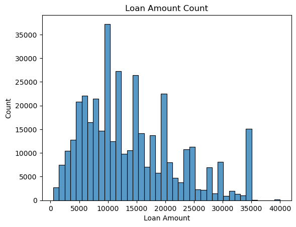
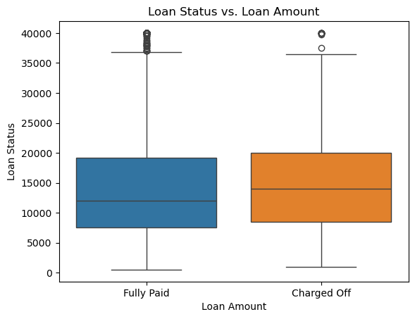

# Lending Club End-to-End Project

## Overview
This project utilizes a dataset from LendingClub, a US-based peer-to-peer lending company, to build a deep learning model that predicts whether borrowers will pay back their loans. **The primary objective of this project is to aid LendingClub in assessing the risk of loan applications, enhancing decision-making processes for loan approvals.** The model is developed using Keras, a powerful deep learning library. The methodologies involded include Data Preprocessing, feature engineering, and a neural network model.

***Data Overview***
The dataset is a subset of the LendingClub data available on Kaggle, which has been specially modified to demonstrate feature engineering techniques. It includes various attributes of loans and borrowers such as loan amount, interest rate, borrower's employment length, credit history, and more.

The dataset includes:

loan amount, loan term, interest rate, monthly payment, loan status, loan grade, loan subgrade, employment title, employment length, home ownership status, annual income, income verification status, loan issue date, loan purpose, loan title, borrower's state and zipcode, debt-to-income ratio, earliest credit line, number of open credit accounts, number of derogatory public records, total revolving credit balance, revolving credit utilization, total credit lines, initial loan listing status, application type, number of mortgage accounts, and number of public record bankruptcies.

## EDA, Feature Engineering, and Data Preprocessing 
***Initial EDA***

I visualized several the relationships in order to get a better understanding of the features and the correlations of those features.

Since we will be attempting to predict loan status, I started with a count plot of the loan statuses. There are many more loans that are Fully Paid compared to Charged off:

I then wanted to tsee the distribution of the loan amounts:

I then wanted to see if there was a relationship between the **loan status and the loan amount**. It seems that there's a slight increase in likelihood of the loan not being paid off if it's higher, which makes sense..

I dove deeper by looking at the summary statistics of the loan status and loan amount. This confirmed the initial findings:

Next I wanted to visualize the **“grade”** (LC assigned loan grade) and the rate of the loans being paid off. As expected, the better grades (ex. A) have a much higher likelihood of being paid off compared to lower grades (ex. G). 

I then wanted to visualize the **subgrade** to see if there was a clear distinction between the subgrades of the grades.

I dug deeper into the F and G subgrades because it's not depicted well in the graph above, and there is a lot lower frequency. 

### correlations

To get a sense of the correlations for all the numeric columns, I created the heatmap below. The lighter the color, the more positevly correlated the two features are. There are very strong correlations between features like "pub_rec_bankruptcies", "open_acc", "total_acc", "int_rate", "annual_income", and more. These all make logical sense given the context and description. 

For example, there's an almost perfect correlation with the "installment" and "loan_amnt" feature, which makes sense given that “installment” is the monthly payment owed by the borrower if the loan originates. I visualized these two features below:

I then wanted to see the correlations of the numeric columns to whether a loan was repaid. This correlation is useful for later on in the project...

## Feature Engineering and Data Preprocessing:
I found that the following columns had null values:

emp_title with 22927 null values, emp_length with 18301 null values, title with 1756 null values, revol_util with 276 null values, mort_acc with 37795 null values,
and pub_rec_bankruptcies with 535 null values.

Given that mort_acc was the most positively correlated to a loan being repaid and it had more than ~9.5% of the rows values missing, I made sure to fill in the null values. I created a multiple Regression model to fill in mort_acc based off the 3 highest correlated features, which is the total accounts, annual income, and loan amount.  MAE of 0.113

The scale of the target variable (mort_acc in your case) plays a crucial role in determining whether an MAE is good. If the range of mort_acc is large (e.g., from 0 to 34 as you've indicated), then an MAE of 0.11155 might be considered very good as it represents a small deviation relative to the range of the data.

I dropped the sub-grades and made "grade" into dummy variables. I did this because to have both would be redundant, and I believe "grade" captures the overall trend of the loans repaid ratio. There is not much difference between the subgrades, and there are also many subgrades with low frequency.

dropped "title" (same as purpose)

dropped "loan_status" (loan_repaid)

turned "term" into a numerical column

changed "dti"

Extract first 3 zipcode numbers from address feature -> Grouped the first 3 letters of the zip code

(First Two Digits: The first two digits narrow down the location to a smaller cluster of states or even parts of a large state. This provides more granularity than just the first digit and could reflect more localized economic conditions without becoming too specific.
First Three Digits: The first three digits of a zip code more closely specify a geographic area and can often pinpoint a sectional center facility, which is a central mail processing facility for an area. This can be useful if small-area variations are significant to the analysis, such as in marketing, local economic analysis, or in-depth demographic studies.)

Changed the home_ownership feature -> Most are in mortgage, rent, or own. Since there's so few in "none" and "any", we'll replace them into "other"

extracted year from 'earliest_cr_line'

Other things I tried to do

Categorized annual_inc -> there are too many unique incoms so I categorized the income by classes from the Census Bureau's 2022 report for Income in the United States, with Lower class: less than or equal to $30,000, Lower-middle class:  30,001– 58,020, Middle class:  58,021– 94,000, Upper-middle class:  94,001– 153,000, and Upper class: greater than $153,000
Dti -> several outliers that are unrealistic or too high. For ex. 9999, +6000, etc. So I deleted the top 0.05% of the values
earliest_cr_line -> Extracted the year from earliest_cr_line then categorized by decade

